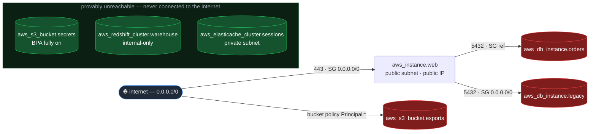

# probepath

**Prove whether an internet‑to‑database attack path actually exists in your Terraform — before you `apply`.**

[](https://github.com/abhisheksoppanna/probepath/actions/workflows/ci.yml)


> Your security scanner screams about 47 misconfigurations. probepath proves 46 are
> unreachable — and shows the **one** real path from the internet to your database, hop by
> hop, before you ever run `terraform apply`.

Per‑resource scanners (Checkov, tfsec, Trivy) flag every open security group and every
`publicly_accessible` flag in isolation. Most of those findings are noise: the resource sits
in a private subnet, or nothing internet‑facing can actually reach it. probepath builds a
**reachability graph** of your Terraform plan and answers the only question that matters —
*can a packet get from the internet to this database?* — then suppresses the findings that
are provably unreachable and renders the ones that aren't.

It models the same network‑admission layer as **AWS VPC Reachability Analyzer**, but it runs
**pre‑apply, on the plan**, fully offline — no account, no API keys, no deployed resources.

```console
$ probepath scan plan.tfplan.json

  Scanned 29 resources · 6 sensitive sinks
  ● 3 reachable    ◐ 0 potentially reachable    ✓ 3 suppressed (provably unreachable)

● REACHABLE  RDS  aws_db_instance.orders
   internet
    └→ aws_instance.web        SG web allows 0.0.0.0/0 on 443; public subnet (0.0.0.0/0 → igw); public IP
    └→ aws_db_instance.orders  SG orders_db allows SG web on 5432

● REACHABLE  RDS  aws_db_instance.legacy
   internet
    └→ aws_instance.web        SG web allows 0.0.0.0/0 on 443; public subnet (0.0.0.0/0 → igw); public IP
    └→ aws_db_instance.legacy  SG legacy_db allows 10.0.1.0/24 on 5432   ← "private subnet" is not a control

● REACHABLE  S3  aws_s3_bucket.exports   [policy/ACL exposure]
   internet
    └→ aws_s3_bucket.exports   bucket policy allows Principal:* with no source scoping

Suppressed — provably unreachable (shown with the gate that closes them):
  ✓ aws_s3_bucket.secrets             — Block Public Access fully enabled
  ✓ aws_redshift_cluster.warehouse    — no internet-reachable network path
  ✓ aws_elasticache_cluster.sessions  — sink subnet is private (no 0.0.0.0/0 → igw route)

$ echo $?     # with --fail-on reachable
1
```

That exit code is the point. Drop `probepath` into CI and a change that opens a path from the
internet to a database **stops shipping** — automatically, with the path printed in the log.

## The attack path, drawn

`probepath explain <sink> --format mermaid` renders the path. The demo stack above:



Note `aws_db_instance.legacy`: it's in a "private" subnet, but its security group is open to
`0.0.0.0/0`, so the compromised public web host pivots straight to it. **"It's in a private
subnet" is not a network control** — and a per‑resource scanner can't see that, because the
finding lives across three resources.

## Why a graph, and why three verdicts

The trust model is the whole product. probepath emits one of **three** verdicts per sink, and
only one of them hides anything:

| Verdict | Meaning | Suppresses the finding? |
|---|---|---|
| **`REACHABLE`** | A concrete path from the internet exists, every hop provably open. | No — shown red, hop by hop. |
| **`POTENTIALLY_REACHABLE`** | Can't prove it unreachable; some input on the path is unknown. | **No** — shown yellow. |
| **`UNREACHABLE`** | *Every* path is provably blocked, with all relevant inputs known. | **Yes** — the only suppressing verdict. |

The cardinal rule: **`UNREACHABLE` is emitted only when the model has complete, known
information proving closure.** If an input on a path is `known after apply`, an unresolved
variable, a managed prefix list we can't see, or a feature we don't model (Transit Gateway,
a third‑party firewall), the verdict degrades to `POTENTIALLY_REACHABLE` and the finding
**stays visible**. A wrongly‑suppressed real path is the one failure mode we treat as fatal —
the [property‑based tests](tests/test_properties.py) exist to hunt it (monotonicity: making a
config *more* permissive can never move a verdict *down* the lattice).

This is why it's reference‑based, not value‑based. At plan time a security group's `id` is
`known after apply`, so `vpc_security_group_ids` is `[null]`. A value‑only tool sees `[null]`
and (fatally) concludes "no path." probepath resolves topology from the plan's symbolic
`configuration.references`, so the `web → db` edge survives the unknown id.

## Install

```bash
pipx install probepath          # once published
# or, from source:
pip install git+https://github.com/abhisheksoppanna/probepath
```

Runtime dependencies: four pure‑Python packages (`networkx`, `typer`, `rich`, `python-hcl2`).
No `boto3`, no network egress — a security tool shouldn't phone home.

## Use

```bash
# 1. produce plan JSON (the highest-fidelity input)
terraform plan -out plan.out
terraform show -json plan.out > plan.tfplan.json

# 2. scan
probepath scan plan.tfplan.json                 # human report
probepath scan plan.tfplan.json -f sarif -o probepath.sarif   # GitHub code scanning
probepath scan plan.tfplan.json --fail-on reachable           # exit 1 if a path exists

# explain one sink in full (including WHY it's safe, when it is)
probepath explain aws_db_instance.orders plan.tfplan.json
```

probepath also reads `.tfstate` and raw `.tf` (HCL is best‑effort — `count`/`for_each`/vars
are unevaluated, so it over‑reports rather than risk a false negative). Plan JSON is primary.

## CI gate (GitHub Action)

```yaml
- run: |
    terraform plan -out plan.out
    terraform show -json plan.out > plan.tfplan.json
- uses: abhisheksoppanna/probepath@v1
  with:
    plan: plan.tfplan.json
    fail-on: reachable        # freeze the deploy on any internet→sink path
    baseline: base.json       # optional: gate only on NEWLY-introduced paths
```

With `baseline`, the check fails only when a PR **introduces** a new path — pre‑existing ones
are surfaced but don't block, so it's adoptable on a messy repo from day one. SARIF results
land in the PR's code‑scanning tab with the hop‑by‑hop path as a code flow.

## What it models

Precisely: route tables & `is_public` derivation (route‑based, never name‑based), security
groups (stateful, CIDR + SG‑to‑SG references + `self`, all‑protocol `-1`), NACLs (stateless,
ordered, ephemeral return path), IGW / NAT / egress‑only IGW, ALB + NLB (incl. SG‑less NLB),
RDS / Aurora / ElastiCache / Redshift / OpenSearch, S3 (Block Public Access + bucket policy +
ACL), IPv4 **and** IPv6, and multi‑hop transitive pivots. Full matrix in [DESIGN.md](DESIGN.md).

## Honest limitations

probepath is a **reachability reasoner, not a security oracle.** It decides whether a
*network path* from an untrusted source to a sensitive sink is possible under AWS's documented
VPC semantics. It does **not** send packets or analyze the data plane, and it does **not**
model: application‑layer auth (DB passwords, IAM DB auth, S3 *authorization* policies, TLS);
host firewalls, service health, listening processes; DNS; AWS Network Firewall / GWLB or
third‑party appliances (→ these degrade a path to `POTENTIALLY_REACHABLE`, never suppress it);
full Transit Gateway route‑table propagation; anything changed outside Terraform after apply.
Documented blind spot: account‑level S3 Block Public Access usually isn't in the Terraform, so
we never assume it exists.

We publish **no accuracy percentage** — there's no labeled ground‑truth corpus to honestly
back one. What we do claim is verifiable: every `UNREACHABLE` names the gate that closes the
path; every `REACHABLE` renders the full path; and the engine is conservative by construction
(`probepath verify-against-aws` is shipped, not run by us, for users who want to cross‑check
verdicts against AWS Reachability Analyzer in their own account).

## How it's built

```
ingest/   terraform plan JSON / tfstate / HCL → normalized records (reference-based resolution)
model/    pure data model: port & CIDR algebra, graph, the three-verdict enum
aws/      AWS semantics, isolated & auditable: security groups, NACLs, routing, ELB, S3
engine/   graph build + constrained reachability search (networkx)
report/   human (rich) · JSON · SARIF 2.1.0 · Mermaid
```

A reviewer can validate correctness by reading `aws/` and `engine/reachability.py` alone.
~2k lines of typed Python (`mypy --strict`), property‑tested, with committed real‑terraform
fixtures regenerated by [`scripts/regen_fixtures.sh`](scripts/regen_fixtures.sh).

## License

MIT — see [LICENSE](LICENSE).
